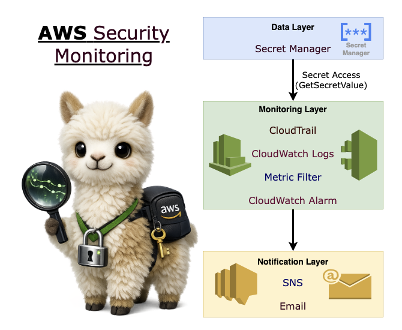
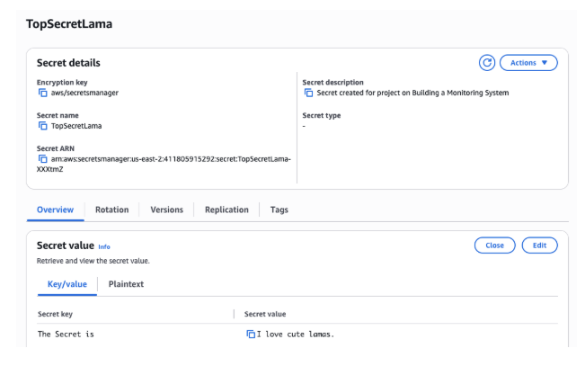
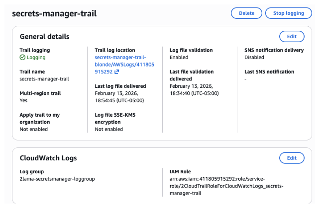
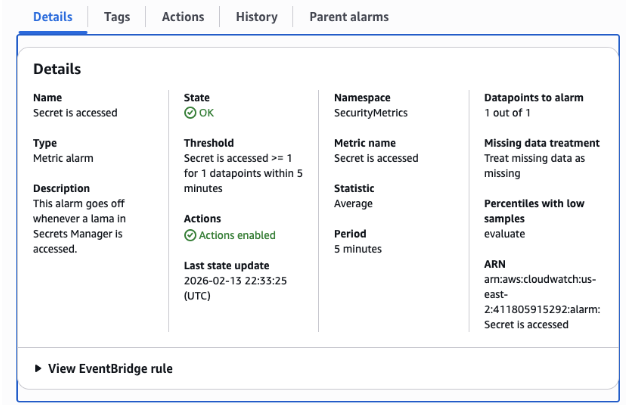
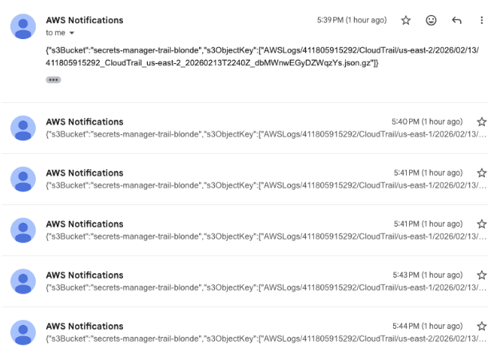

# 🦙 AWS Security Monitoring System

**Tracking Secret Access with CloudTrail, CloudWatch & SNS**

---

## 📌 Project Overview


<p align="center">
  
</p>


In this project, I built a security monitoring pipeline that detects when an AWS secret is accessed and sends real-time notifications.

The goal was to simulate a real-world security scenario:

- Store sensitive data securely  
- Monitor access events  
- Trigger alerts on suspicious activity  

This project demonstrates practical use of:

- AWS Secrets Manager  
- AWS CloudTrail  
- AWS CloudWatch Logs  
- CloudWatch Metric Filters  
- CloudWatch Alarms  
- Amazon SNS  


---

## 🧠 Architecture Summary


1. A secret is stored in **AWS Secrets Manager**

<p align="center">
  
</p>
 
2. Secret access triggers a **CloudTrail management event**

<p align="center">
  
</p>

3. CloudTrail logs are delivered to:
   - S3 bucket  
   - CloudWatch Logs  
4. A **CloudWatch Metric Filter** scans logs for `GetSecretValue`


<p align="center">
  
</p>

5. A **CloudWatch Alarm** triggers if metric ≥ 1 within a 5-minute period  
6. The alarm publishes a notification to **SNS**  
7. Email notification is delivered to the subscriber  

<p align="center">
  
</p>

---

## 🔐 Key Security Concepts Demonstrated

- Management vs Data events in CloudTrail  
- Read vs Write API activity  
- Metric filters for targeted detection  
- Alarm threshold configuration  
- SNS topic confirmation workflow  
- Why CloudWatch alarms provide more precise detection than raw CloudTrail notifications  

---

## 🚨 Why This Matters

Direct SNS notifications from CloudTrail can generate excessive noise.

Using **CloudWatch metric filters** provides:

- 🎯 Event-level precision  
- ⏱ Controlled alert thresholds  
- 🔕 Reduced alert fatigue  

This mirrors how production SOC monitoring pipelines are designed.

---


## 🧪 Testing & Validation

- Retrieved secret via AWS Console  
- Retrieved secret via AWS CLI  
- Verified CloudTrail event lookup  
- Confirmed CloudWatch metric increments  
- Confirmed SNS email delivery  

---

## 📊 Lessons Learned

- CloudTrail Event History retention is limited to 90 days  
- CloudWatch enables long-term filtering and alerting  
- SNS subscriptions must be confirmed before notifications are delivered  
- Effective monitoring requires balancing signal vs noise  

---

## 🎯 Outcome

A functional real-time monitoring system capable of detecting and alerting on secret access events in AWS.


## 📁 Project Structure (Root)

```
AWS-Security-Monitoring-System/
├── README.md
└── screenshots/
    ├── cute_lama.png
    ├── secret_details.png
    ├── secret_trail.png
    ├── metrics_details.png
    ├── SNS.png
    └── placeholder.txt
```

